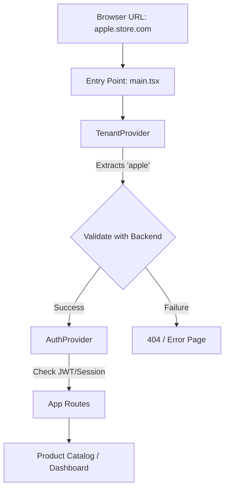

# Frontend Architecture: Multi-Tenant E-Commerce Platform

## Note: Not final Architecture!

## 1. Overview

This is a **React 19** application built with **TypeScript** and **Vite**. It is designed to consume a multi-tenant Django API. The frontend is "tenant-aware," meaning it dynamically adapts its behavior, branding, and data fetching based on the resolved tenant.

The system ensures **strict tenant data isolation** at the UI and API request layers, providing a seamless and secure experience for each organization.

---

## 2. Architectural Goals

### Primary Goals
- **Zero tenant data leakage**: Ensure cache and state are strictly isolated.
- **Dynamic Branding**: Adapt UI (colors, logos, content) based on tenant settings.
- **Scalable Module Structure**: Maintainable domain-oriented organization.
- **Type Safety**: Strict TypeScript enforcement to match backend serializers.

### Non-Goals
- Cross-tenant UI components.
- Local-only tenant switching (requires full reload/resolution).
- Offline-first capabilities (for now).

---

## 3. Technical Stack

- **Framework**: React 19 (Functional Components, Hooks)
- **Build Tool**: Vite
- **Type System**: TypeScript (Strict Mode)
- **State Management**:
    - **Server State**: TanStack Query v5 (Caching, synchronization)
    - **Client State**: Zustand (UI state, persistent settings)
- **Styling**: Tailwind CSS (Utility-first)
- **API Client**: Axios (Interceptors for Auth & Tenant headers)

---

## 4. High-Level Frontend Flow



**Key rule:**
The application must resolve and validate the **tenant context** before rendering any protected or tenant-specific content.

---

## 5. Directory Structure

We follow a **Module-based (Domain-driven)** structure to mirror the backend's organization.

```
src/
├── api/              # Global Axios instance & API constants
├── assets/           # Global images, fonts, styles
├── components/       # Atomic UI components (Button, Input, Modal)
├── config/           # Environment variables & Global constants
├── hooks/            # Global utility hooks (useLocalStorage, useDebounce)
├── layouts/          # Page wrappers (AdminLayout, CustomerLayout)
├── modules/          # Feature-specific logic (The "Core")
│   ├── auth/         # Login, Register, Password Reset
│   ├── products/     # Product grid, Detail, Category filters
│   ├── orders/       # Cart, Checkout, Order History
│   └── tenant/       # Subdomain resolution, Tenant branding
├── providers/        # Context Providers (QueryClient, Auth, Theme)
├── types/            # TypeScript Interfaces (Matches Django Serializers)
└── utils/            # Helper functions (Formatters, Validators)
```

---

## 6. Tenant Resolution Strategy

The frontend determines the `tenant_id` via the subdomain, mirroring the backend's `TenantAwareMiddleware` logic.

1. **Extraction**: On app load, `TenantProvider` parses `window.location.hostname`.
2. **Validation**: A request is sent to `/api/tenants/verify/?slug=subdomain`.
3. **Context**: The resulting `Tenant` object (branding, logo, settings) is stored in a React Context.
4. **Isolation**: Every subsequent API call includes the `X-Tenant-ID` header (or relies on the subdomain-routed backend).

---

## 7. Data Management Rules

### Server State (TanStack Query)
- **Keying (Critical)**: All cache keys must be unique per tenant to prevent data leakage.
    - ✅ **Correct**: `['products', tenantId]`
    - ❌ **Incorrect**: `['products']`
- **Stale Time**: Product data defaults to 5 minutes; checkout/cart data is 0 (always refetch).

### Type Safety
- **Interfaces**: Every API response must have a corresponding TypeScript interface that matches the Django Serializer.
- **No `any`**: The use of `any` is prohibited. Use `unknown` or specific generics.

---

## 8. Authentication & Security

### Guiding Principle
**Authentication is global. Authorization is tenant-scoped.**

- **Storage**: JWT Access tokens are stored in memory; Refresh tokens are stored in `HttpOnly`, `Secure` Cookies (set by Django).
- **Interceptors**: Axios interceptors handle `401 Unauthorized` by attempting a token refresh.
- **Route Guarding**: Specialized Route wrappers protect tenant-admin pages, ensuring the user has the correct role for the current tenant.

---

## 9. Styling & Theming

- **Tailwind CSS**: Use standard utility classes.
- **Dynamic Theming**: Tenant-specific colors (e.g., "Brand Primary") are injected via CSS Variables defined in the `TenantProvider`.
    - **Example**: `bg-[var(--brand-primary)]`

---

<!-- Not needed for now.
## 10. Testing Standards

- **Unit Testing**: Vitest for utility functions and hooks.
- **Component Testing**: React Testing Library.
- **E2E Testing**: Playwright (Critical for testing subdomain routing and tenant isolation).
- **Isolation Tests**: Verify that data from one tenant does not appear when switched to another subdomain. -->

---

## 11. Security Considerations

- **XSS Mitigation**: React's built-in escaping + Content Security Policy (CSP).
- **CSRF Protection**: Handled via Django's CSRF middleware and Axios configuration.
- **Storage Isolation**: Avoid storing sensitive tenant data in `localStorage` unless absolutely necessary and scoped by `tenantId`.

---

## 12. How to Use This Document

This document serves as the source of truth for frontend architectural decisions. If the implementation deviates from these rules without a documented reason, **the code is considered incorrect**.
